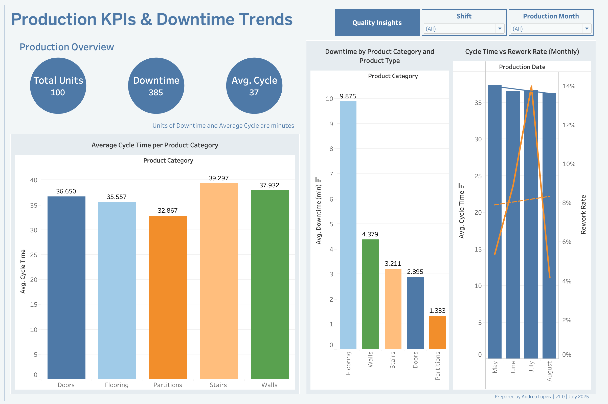
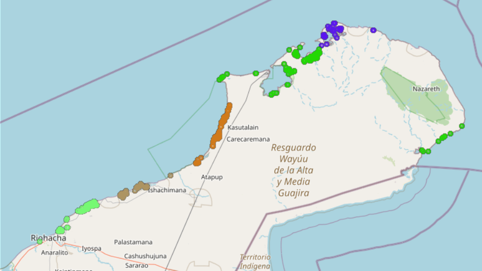
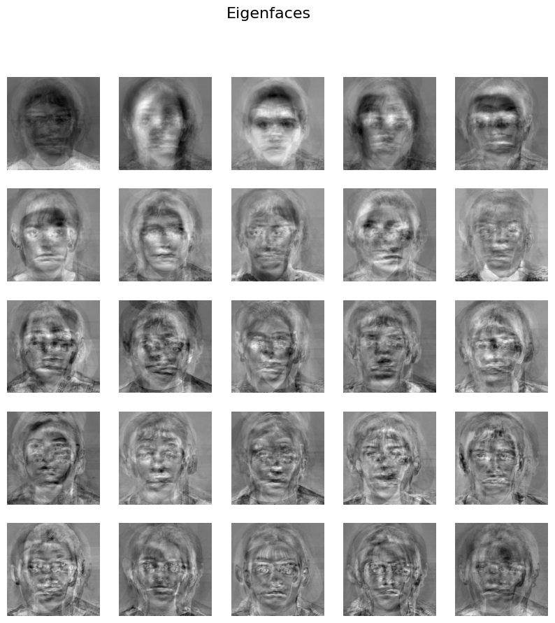
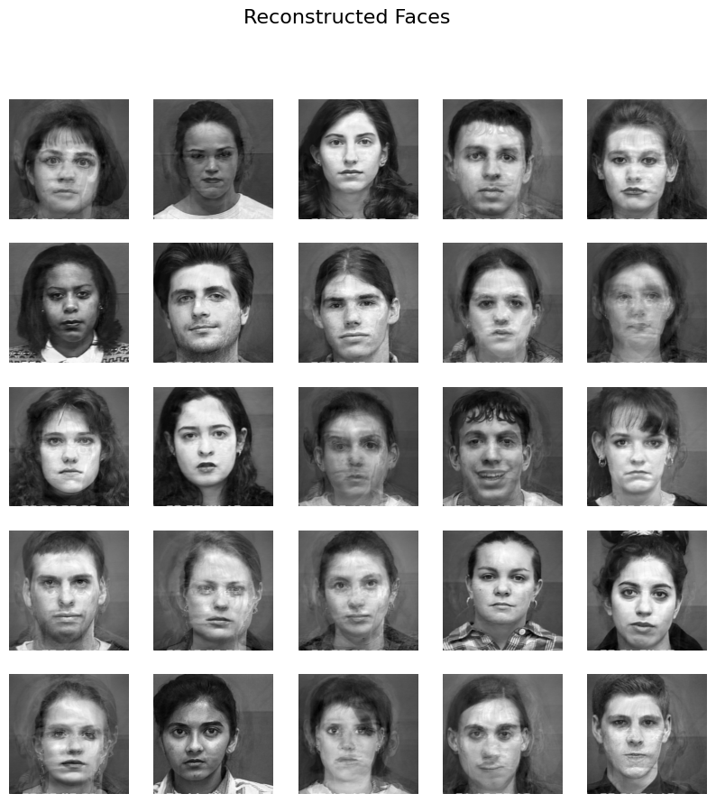

## Core Skills
**Python** (Pandas, NumPy, Scikit-learn, PyTorch) • **SQL** • **Power BI** • **Tableau** • **SPSS** • **Excel** • **Geospatial Analytics** • **Data Modeling** • **Workflow Automation** • **Dashboards** • **ERP & QMS Systems** • **Lean Manufacturing**

---

## Projects

### Production & Operations Analytics

#### [Production Line Intelligence & Rework Risk Modeling](https://github.com/andrea-lopera/Production-Line-Intelligence-Dashboard)  | Python, SQL, Tableau | 2025  
Simulated a multi-stage glass manufacturing line with 50k+ production records to track cycle times, quality outcomes, and downtime across shifts, machines, and product families.
- Used Python to generate realistic production logs (JSON) and QC audit data (CSV), then modeled them in PostgreSQL with relational schemas, joins, and window functions to engineer features such as cumulative downtime per machine.
- Designed Tableau dashboards to monitor throughput, rework rate, and average cycle time by product category, shift, and machine, supporting root-cause analysis of performance and quality issues.
- Trained classification models (Logistic Regression / Random Forest) to predict the rework flag from process times and product attributes, demonstrating how analytics can proactively flag high-risk units before they leave the line.
  

#### [Global Supply Chain & Procurement Intelligence (End-to-End Analytics)](https://github.com/andrea-lopera/Procurement-Intelligence-Dashboard-main)  | Python, Tableau | 2025

Built an end-to-end procurement analytics stack by designing and generating a robust, 9,750-row synthetic dataset (orders, suppliers, lead times, defects, costs, and risk scores). The synthetic data was structurally modeled to mirror the high-complexity, low-volume supply chain of heavy equipment manufacturing.

- Engineered core procurement KPIs: On-Time, In-Full (OTIF), Cost of Poor Quality (COPQ $), and a CR5 supplier concentration metric to measure sourcing risk. 
- Developed Tableau dashboards (Executive Overview, Supplier Performance, Risk & Geo) with Pareto, Top-5, trend, and geographic views.
- Identified key cost drivers by tracing defect trends back to specific supplier process variation and highlighted bottlenecks using lead-time variability analysis.

---

### Geospatial & Public Sector Analytics

#### [Mapping Water Bodies for Drought Relief](https://github.com/andrea-lopera/Identifying-Water-Bodies-Near-Drought-Affected-Regions) | Python, Power BI, Folium | 2025  
Created a geospatial analytics tool to support drought response using NASA & USGS satellite data.  
- Mapped nearby water sources to drought regions using spatial joins and clustering  
- Delivered insights via Power BI dashboards and interactive Folium maps  
- Empowered environmental planners with data-driven visibility into critical areas  

- The black line represents the actual NDWI trend, indicating real water conditions in the region.
- The blue dashed line shows predictions from SARIMA.
- The green lines shows improved predictions.

---

### AI & Computer Vision

#### Facial Recognition System | PCA, LDA, Python | 2024  
Built a facial recognition system using classical techniques (Eigenfaces, PCA/LDA).  
- Applied transfer learning, face alignment, and reconstruction evaluation  
- Improved classification accuracy by 43.7% over the baseline  
- Combined dimensionality reduction and clustering to optimize predictions

#### Image Classification with CNNs | ResNet-18, PyTorch, Transfer Learning | 2024  
Trained deep learning models from scratch and via transfer learning.  
- Achieved 93.4% accuracy with fine-tuned ResNet  
- Used PyTorch Lightning for reproducibility and early stopping  
- Documented results with metric analysis and visual tracking  

---

## Education & Training

- **M.S. Data Science** – UT Arlington (2025)  
- **M.Ed. Mathematics** – Texas Christian University (2022)
- **Engineering in Data Analysis (In Progress)** – Transferred from Industrial Engineering  
- **B.A. Education** – UT Arlington (2020)  
- **Production Engineering** – EAFIT University, Colombia (2016)  
- **Quality Assurance Tech.** – ITM University, Colombia (2009)

**Certifications & Training**  
- MIT Applied Data Science Program (2023)  
- NASA ARSET: Machine Learning for Space Exploration (2023)

---

## Let’s Connect

[LinkedIn](https://www.linkedin.com/in/andrea-lopera-optimization/) • ✉️ [Email Me](mailto:loperaandreaa@gmail.com)

---

