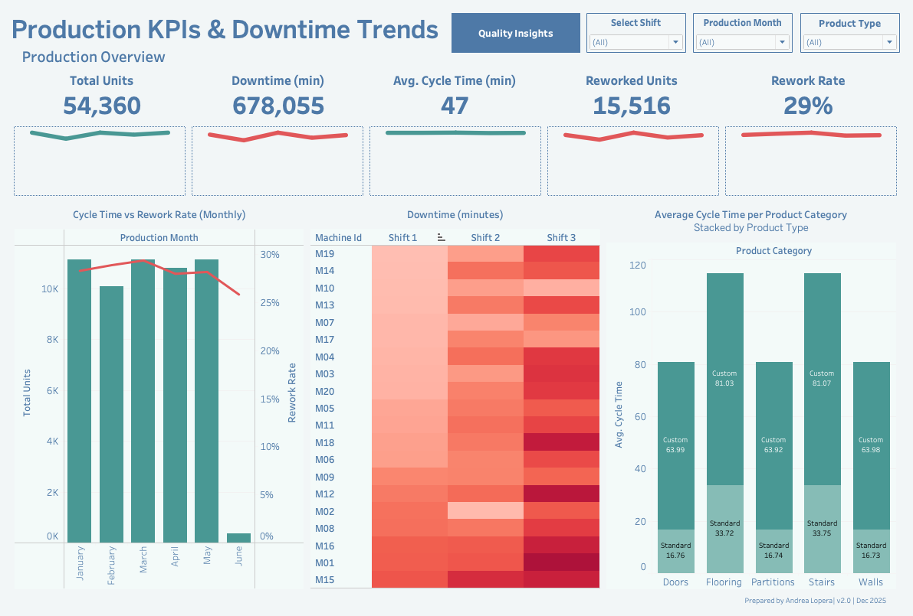
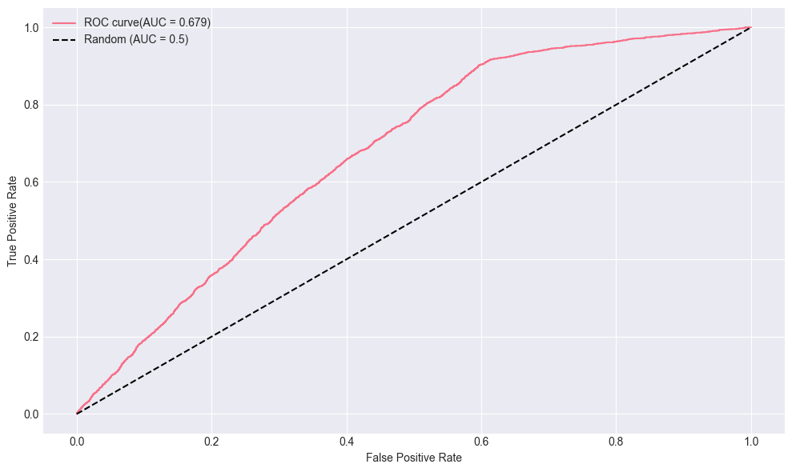

## Core Skills
**Python** (Pandas, NumPy, Scikit-learn, PyTorch) • **SQL** • **Power BI** • **Tableau** • **SPSS** • **Excel** • **Geospatial Analytics** • **Data Modeling** • **Workflow Automation** • **Dashboards** • **ERP & QMS Systems** • **Lean Manufacturing**

---

## Projects

### Production & Operations Analytics

#### [Production Line Intelligence & Rework Risk Modeling](https://github.com/andrea-lopera/Production-Line-Intelligence-Dashboard)  | Python, SQL, Tableau | 2025  
This project simulates a multi-stage glass manufacturing line and builds an end-to-end analytics stack around it. Using Python, I generate realistic production logs (JSON) and quality audit data (CSV), then load them into PostgreSQL to model the process with relational schemas, joins, and window functions. On top of that, I design Tableau dashboards to monitor throughput, rework rate, and cycle time across shifts, machines, and product families. Finally, I train machine learning models (Logistic Regression and Random Forest) to predict which units are likely to require rework and to classify the most probable rework root cause, showing how analytics can proactively support production and quality decisions.

##### Production Dashboard

##### Rework Risk

**Logistic Regression (class-weighted)**

**Model Evaluation Metrics**

| Metric    | Value |
|----------|-------|
| Accuracy | 0.567 |
| Precision (class 1) | 0.381 |
| Recall (class 1)    | 0.828 |
| F1 (class 1)        | 0.522 |

**ROC Curve**  

**Feature Importance (Top Features)**  

**Random Forest (tuned)**

**Model Evaluation Metrics**

| Metric    | Value |
|----------|-------|
| Accuracy | 0.539 |
| Precision (class 1) | 0.374 |
| Recall (class 1)    | 0.914 |
| F1 (class 1)        | 0.531 |

**ROC Curve**  

**Feature Importance (Top Features)**  

**Model Selection**

| Model                                |   Accuracy |   Precision |   Recall |       F1 |
|:-------------------------------------|-----------:|------------:|---------:|---------:|
| Logistic Regression (class_weighted) |   0.566703 |    0.380707 | 0.827995 | 0.52159  |
| Random Forest (tuned)                |   0.539108 |    0.373984 | 0.913517 | 0.530703 |

**Observations:**

From a business standpoint, the main goal is to **catch as many bad units as possible** before they leave the line. Therefore, recall on the rework class is the priority, since missing a defective unit (false negative) is more costly than over-flagging a good unit.

- The tuned Random Forest (RF) model catches **~91%** of rework units vs **~83%** for Logistic Regression (LR).
- F1 is slightly better for RF, meaning it balances precision/recall a bit better for the rework class.
- Interpretability vs performance:  
  - **LR** is kept as a baseline and explanation tool, with clear coefficients showing how standard vs custom, flooring/stairs, and Shift 3 affect risk.  
  - **RF** is used as the operational model because it handles non-linear interactions and gives the best recall on rework risk, with similar ROC-AUC.

**Conclusion:**  
I use Logistic Regression as a transparent benchmark, but deploy the tuned Random Forest as the main rework-risk model because it maximizes recall on bad parts while maintaining comparable overall performance.

##### Rework Reason (3 Buckets)

**Random Forest (grouped buckets)**

**Model Evaluation Metrics (Test Set)**

| Class / Bucket                   | Precision | Recall | F1   | Support |
|----------------------------------|----------:|-------:|-----:|--------:|
| Dimensional / Assembly Issues    |     0.95  |  0.93  | 0.94 |   2377  |
| Equipment / Human Factors        |     0.89  |  0.98  | 0.93 |    541  |
| Surface / Material Defects       |     0.33  |  0.30  | 0.32 |    204  |
| **Overall Accuracy**             |           |        | **0.90** | 3122 |
| **Macro Avg**                    |     0.72  |  0.74  | 0.73 |        |
| **Weighted Avg**                 |     0.90  |  0.90  | 0.90 |        |

**ROC Curves**  

**Feature Importance (Top Features)**  

**Observations:**

- The model achieves **high precision and recall for Dimensional / Assembly Issues and Equipment / Human Factors**, meaning it reliably separates these two major rework buckets.
- Surface / Material Defects has much lower precision/recall, reflecting that this bucket is rarer and harder to distinguish from the other two.
- The strongest drivers of predicted rework bucket are **machine_id_M15 and machine_id_M16**. The model has learned that when a unit comes from these machines, the type of rework needed is more predictable than for other machines (they are used as early decision splits in the trees).
- Process times (cutting_time, cycle_time, tempering_time, framing_time) also contribute substantially, meaning **how long the unit spends in each stage** helps the model distinguish the type of defect.
- Shift 3 and, to a lesser extent, Shift 2 matter as well, indicating that **time-of-day / staffing patterns influence which kind of defect tends to occur**.

**Conclusion:**  
The model effectively shows that **machine identity and process times are strong signals of *what kind* of defect occurs, not just whether a defect occurs at all**. In a real plant, this would support **machine-specific corrective actions** (maintenance, calibration, operator training) rather than generic “quality is bad” interventions.

  

#### [Global Supply Chain & Procurement Intelligence (End-to-End Analytics)](https://github.com/andrea-lopera/Procurement-Intelligence-Dashboard-main)  | Python, Tableau | 2025

Built an end-to-end procurement analytics stack by designing and generating a robust, 9,750-row synthetic dataset (orders, suppliers, lead times, defects, costs, and risk scores). The synthetic data was structurally modeled to mirror the high-complexity, low-volume supply chain of heavy equipment manufacturing.

- Engineered core procurement KPIs: On-Time, In-Full (OTIF), Cost of Poor Quality (COPQ $), and a CR5 supplier concentration metric to measure sourcing risk. 
- Developed Tableau dashboards (Executive Overview, Supplier Performance, Risk & Geo) with Pareto, Top-5, trend, and geographic views.
- Identified key cost drivers by tracing defect trends back to specific supplier process variation and highlighted bottlenecks using lead-time variability analysis.

---

### Geospatial & Public Sector Analytics

#### [Mapping Water Bodies for Drought Relief](https://github.com/andrea-lopera/Identifying-Water-Bodies-Near-Drought-Affected-Regions) | Python, Power BI, Folium | 2025  
Created a geospatial analytics tool to support drought response using NASA & USGS satellite data.  
- Mapped nearby water sources to drought regions using spatial joins and clustering  
- Delivered insights via Power BI dashboards and interactive Folium maps  
- Empowered environmental planners with data-driven visibility into critical areas  

- The black line represents the actual NDWI trend, indicating real water conditions in the region.
- The blue dashed line shows predictions from SARIMA.
- The green lines shows improved predictions.

---

### AI & Computer Vision

#### Facial Recognition System | PCA, LDA, Python | 2024  
Built a facial recognition system using classical techniques (Eigenfaces, PCA/LDA).  
- Applied transfer learning, face alignment, and reconstruction evaluation  
- Improved classification accuracy by 43.7% over the baseline  
- Combined dimensionality reduction and clustering to optimize predictions

#### Image Classification with CNNs | ResNet-18, PyTorch, Transfer Learning | 2024  
Trained deep learning models from scratch and via transfer learning.  
- Achieved 93.4% accuracy with fine-tuned ResNet  
- Used PyTorch Lightning for reproducibility and early stopping  
- Documented results with metric analysis and visual tracking  

---

## Education & Training

- **M.S. Data Science** – UT Arlington (2025)  
- **M.Ed. Mathematics** – Texas Christian University (2022)
- **Engineering in Data Analysis (In Progress)** – Transferred from Industrial Engineering  
- **B.A. Education** – UT Arlington (2020)  
- **Production Engineering** – EAFIT University, Colombia (2016)  
- **Quality Assurance Tech.** – ITM University, Colombia (2009)

**Certifications & Training**  
- MIT Applied Data Science Program (2023)  
- NASA ARSET: Machine Learning for Space Exploration (2023)

---

## Let’s Connect

[LinkedIn](https://www.linkedin.com/in/andrea-lopera-optimization/) • ✉️ [Email Me](mailto:loperaandreaa@gmail.com)

---

